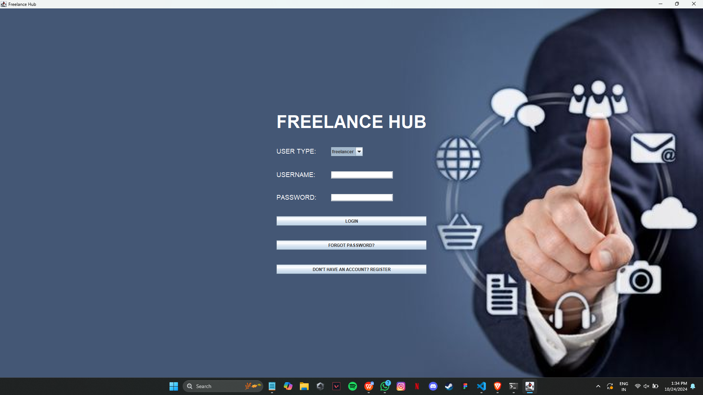
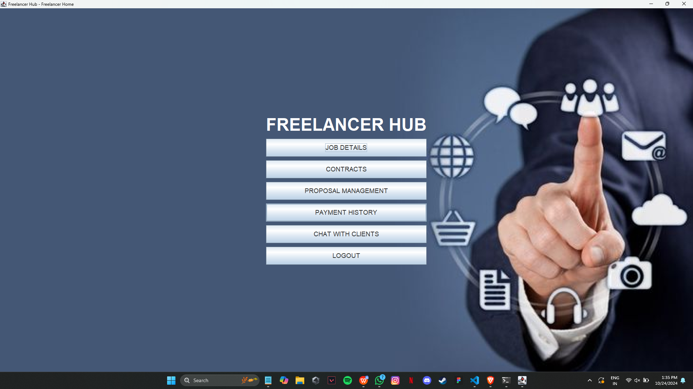
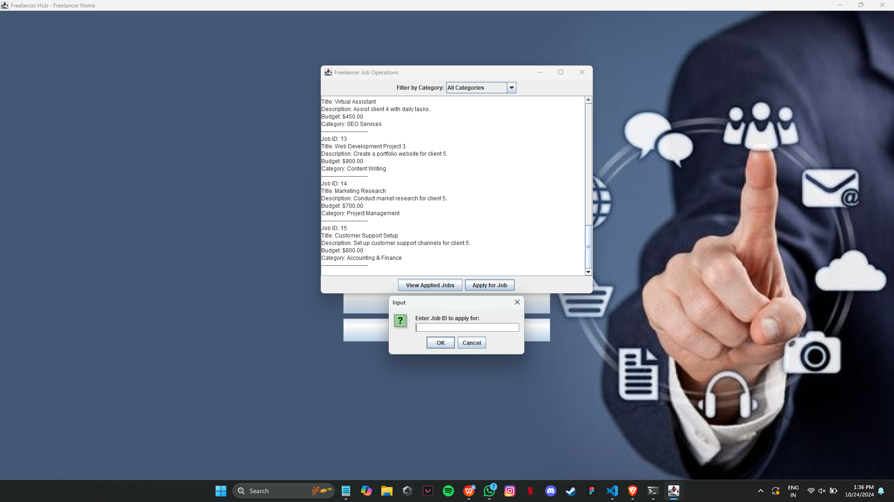
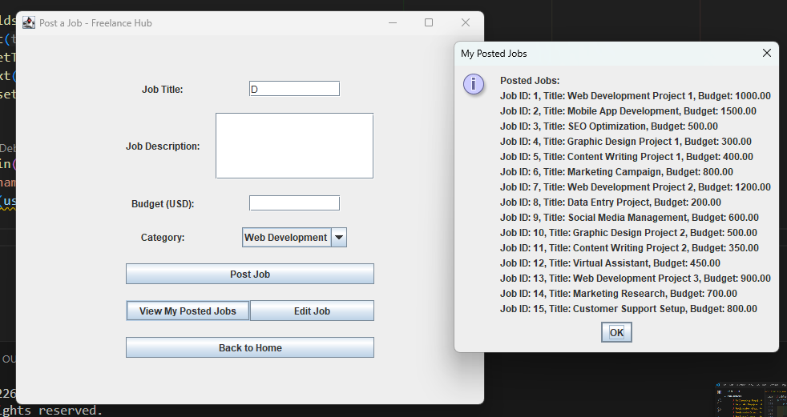

# Freelancer Hub – Java-Based Freelancing Platform

Freelancer Hub is a full-stack Java Swing desktop application inspired by platforms like **Upwork** and **Freelancer.com**. It allows clients to post jobs, freelancers to apply, and both parties to manage proposals, contracts, payments, and direct communication — all backed by a MySQL relational database.

---

## Features

### User Authentication
- Secure login and registration
- Role-based access for **Clients** and **Freelancers**

### Job Management (Client Side)
- Post, view, and edit job listings
- View submitted proposals for each job

### Proposal System (Freelancer Side)
- Browse jobs by category
- Submit proposals with bid amount and cover letter
- Withdraw proposals if needed

### Contract and Payment Flow
- Automatic contract creation when a proposal is accepted
- Freelancers can request payments
- Clients can approve payments and leave reviews
- View payment history by user

### Messaging System
- Role-based message sending (Client ↔ Freelancer)
- View received messages

---

## Technologies Used

- **Java** with **Swing** for GUI
- **MySQL** as the backend database
- **JDBC** for database connectivity
- **Visual Studio Code** as the IDE

---

## Sample Screens

### Login Page

### Freelancer Dashboard

### Job Dashboard

### Job Posting Interface

---

## Project Structure (Database Overview)

- `users`: Contains user information and user type (client/freelancer)
- `jobs`: Stores job posts by clients
- `proposals`: Records freelancer proposals
- `contracts`: Created when a proposal is accepted
- `payments`: Stores approved payment details
- `messages`: Manages in-app messaging
- `categories`: Predefined list of job categories

---

## License

This project is licensed under the **MIT License**.

---

## 🤝 Contributing

Pull requests and suggestions are welcome! For major changes, please open an issue first to discuss what you would like to improve.

---

## 📬 Contact

Have questions or want to collaborate?  
Feel free to connect via GitHub or email.
